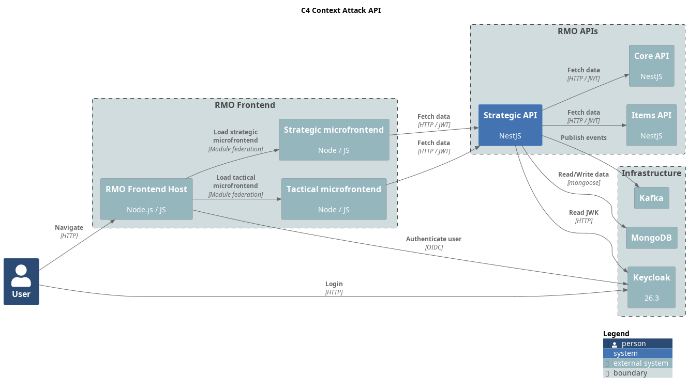

= Rolemaster Unified Strategic API

REST API for RMO strategic management of games. This API is in charge of defining the campaigns and characters of a game
while the tactical API is in charge of resolving the combats that occur.

This project is part of RMU Online: https://github.com/labcabrera/rmu-platform

WARNING: *This application is an independent project developed by fans of Rolemaster Unified. It is not affiliated with, endorsed by, or licensed by Iron Crown Enterprises (ICE), the owners of the Rolemaster intellectual property.*
*All Rolemaster trademarks, game systems, and materials are the property of Iron Crown Enterprises. This software is provided for personal, non-commercial use only. If you enjoy Rolemaster, please support the official publications and content from ICE.*

== Main entities

* *Strategic Game*: A strategic game represents a campaign that can consist of several battles (tactical games). Each campaign
has a series of factions that function as if they were independent gangs.

* *Faction*: A faction is a group of characters who share resources such as gold.

* *Character*: Represents a character belonging to a gang with characteristics such as attributes, skills, items, etc.